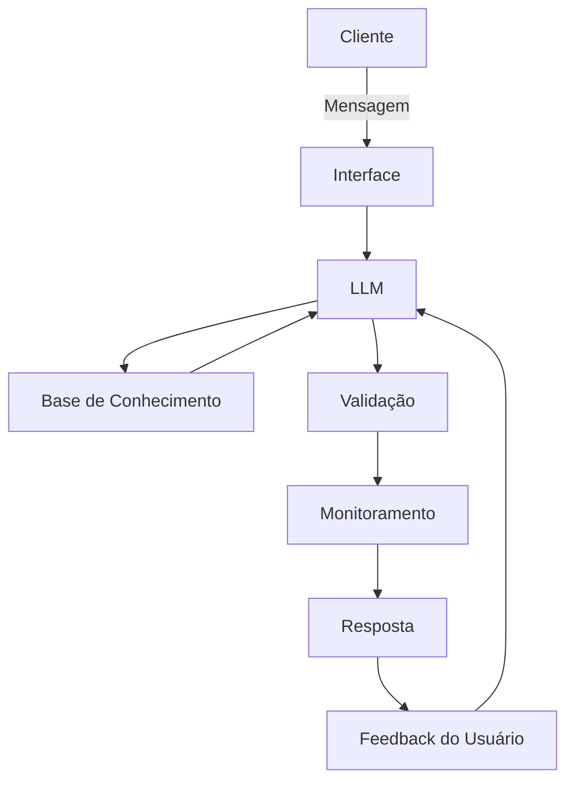

# Documentação do Agente

## Caso de Uso

### Problema
> Qual problema financeiro seu agente resolve?

Clientes enfrentam fraudes em transações digitais

### Solução
> Como o agente resolve esse problema de forma proativa?

O Agente atua como solução preventiva ao monitorar,alertar e educar em tempo real

### Público-Alvo
> Quem vai usar esse agente?

Clientes Bancários e usuários de fintechs

---

## Persona e Tom de Voz

### Nome do Agente
Maya AI

### Personalidade
> Como o agente se comporta?

Direto e Educativo

### Tom de Comunicação
> Formal, informal, técnico, acessível?

Informal e acessível

### Exemplos de Linguagem
- Saudação: Oi! Tudo bem? Vamis resolver juntos,me diz sua dúvida.
- Confirmação: [ex: "Entendi! Vou conferir para você.
- Erro/Limitação: Ainda não tenho essa informação,mas posso te orientar em outra coisa.

---

## Arquitetura

### Diagrama

### Componentes

| Componente | Descrição |
|------------|-----------|
| Interface | Chatbot em Streamlit |
| LLM | Meta Llama 3.1 8b |
| Base de Conhecimento | JSON/CSV com dados do cliente |
| Validação | Checagem de alucinações |

---

## Segurança e Anti-Alucinação

### Estratégias Adotadas

- [ ] O Agente só responde com base nos dados fornecidos [CSV/JSOM]
- [ ] As respostas incluem informações sempre que possível
- [ ] O agente não recomendações de investimentos sem perfil do cliente
- [ ] Implementa checagem de alucinação: respostas passam por validação antes de serem mandadas para o cliente
- [ ] Monitoramente de interações para prevenir suspeitas e fraudes

### Limitações Declaradas
> O que o agente NÃO faz?
- Recomendações financeiras sem análise do perfil
- Interações ofensivas
- Compartilhamento de dados sensíveis
- Previsões de mercado ou garantias de retorno
- Ações fora do escopo de consulta

[Liste aqui as limitações explícitas do agente]
